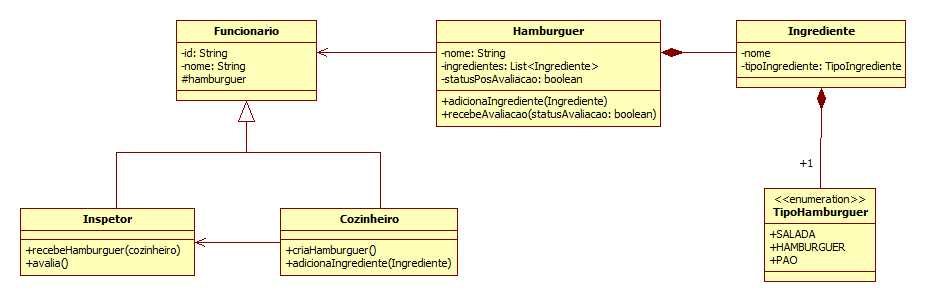

# Você Hamburguer 
Esse projeto tem com objetivo ser uma atividade de DOJO desenvolvida pra os encontros semanais da SMU Crowdfunding. 

## Desafio

O dono da lanchonete Você Hambúrguer, deseja criar um sistema para garantir que a produção dos Hambúrgueres seja informatizada. Cada hambúrguer é produzido com 3 ingredientes básicos: um pão, um hambúrguer e uma salada.

Existem apenas dois funcionários em cadas estabelecimento. Um cozinheiro e um inspetor, sendo que, ele inspeciona todos os hambúrgueres. 

Após a avaliação, um serviço de *delivery* é utilizado, ele faz entrega de apenas hambúrgueres que possuem avaliação positiva.

### Diagrama de Domínio

## # Desafio

Implemente primeiramente os testes para validar a construção, avaliação e entrega dos hambúrgueres. Posteriormente faça a implementação de todos os métodos para obter 100% em todos os testes.

##### Validações:

    • Os lanches podem conter apenas 3 ingredientes.
    • Esses 3 ingredientes devem ser diferentes.
    • Apenas o cozinheiro pode fazer os hambúrgueres. 
    • Ambos Cozinheiro e Inspetor devem possuir o histórico do último hamburguer avaliado.
    • O serviço de entrega apenas hambúrgueres avaliados positivamente.

### Desenvolvido por: 
[Bruno Albuquerque Brito](https://www.linkedin.com/in/bruno-albuquerque-brito-07258590)
